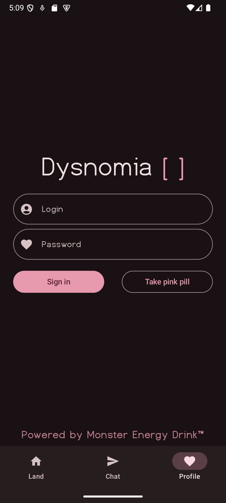
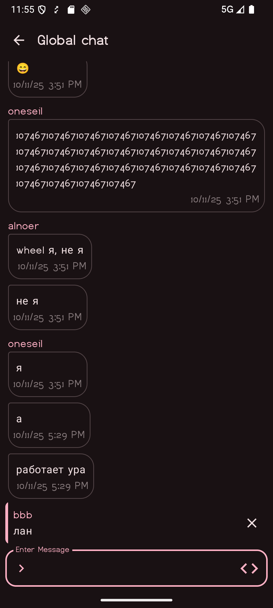

# Dysnomia

Free and open-source chat application

## Features
* Jetpack Compose
* MVVM Architecture
* Navigation with NavHost
* Retrofit as HTTP client
* Room for storing conversations
* Hilt for dependency injection
* DataStore Preferences for saving settings
* Detekt linting

## Screenshots

|  |  |
|------------------------------------|------------------------------------|
